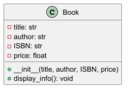

# 📖 Book Class (Python)

## 📌 Описание
Этот проект реализует класс `Book`, который содержит информацию о книге.  
Он включает в себя атрибуты и методы, позволяя создавать объекты и выводить данные.

## 🔹 Структура класса (UML)

## 🛠 Функционал
- **Атрибуты**: `title`, `author`, `ISBN`, `price`
- **Методы**:
  - `display_info()` — вывод информации о книге

